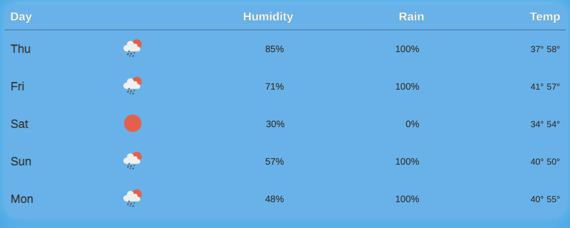
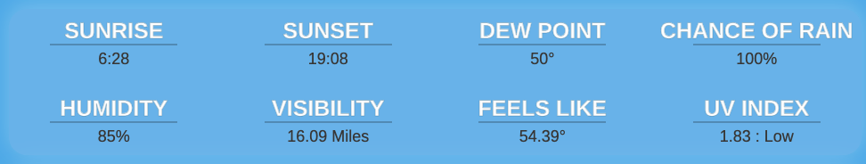
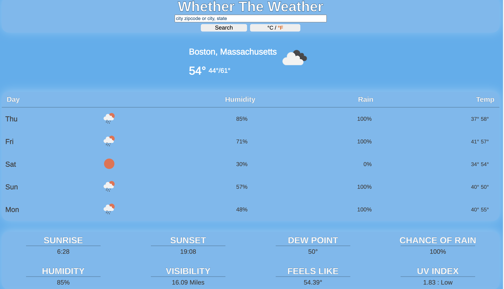

# Whether the weather
## Provides accurate weather info, daily metrics, and five day forecasts for any location on earth!

# Creator
  - Blain Crawford

Created to provide accurate weather information for any location on earthusing Open Weather Api.

# Deployed at:
 https://blain-crawford.github.io/Whether-the-weather-app/

 This project is from the <a href="https://www.theodinproject.com/">Odin Project</a> curriculum.

 # Technologies Used:

 -  JavaScript
 -  CSS
 -  HTML
 -  webpack
 -  Visual Studio Code
 -  Git/Github
 -  babel
 -  gh-pages
 -  Prettier
 -  ESLint
 -  regenerator-runtime/runtime

 # Third Party Code:

 -  <a href="https://openweathermap.org/">Open Weather API</a>
 -  <a href="https://dafont.com">DaFont Fonts</a>

 # Application Functionality
 <ul> 
  <li> Whether the Weather can search cities in the with the following criteria</li>
  <li>Weather the Weather allows the user to choose to view the information in either imperial or metric units</li>
    <ul>
      <li>City Name</li>
      <li>Zipcode (For citites in USA)</li>
      <li>
      City Name, State (For citites in USA)
      </li>
    </ul>
  <li>Whether the Weather Shows current weather Information including:</li>
    <ul>
      <li>Current Temp</li>
      <li>High and Low Temp</li>
      <li>Current Weather</li>
    </ul>
    
  <li>Whether the Weather also provides a five day forecast for the searched location including:</li>
    <ul>
      <li>Name of day</li>
      <li>Daily Weather</li>
      <li>Daily Humidity</li>
      <li>Daily Chance of Rain</li>
      <li>Daily high and low temp</li>
    </ul>
    
  <li>Whether the Weather also displays metrics for the current day of the location being searched.</li>
  <li>These Metrics include</li>
    <ul>
      <li>Sunrise Time</li>
      <li>Sunset Time</li>
      <li>Dew Point</li>
      <li>Chance of Rain</li>
      <li>Humidity</li>
      <li>VVisibility</li>
      <li>
        What the temperature feels like
      </li>
      <li>UV Index</li>
    </ul>
    
  <li>Whether the Weather is designed to scale to fit use in any mobile device!</li>
</ul>
# Running Application

- Clone Repository
Use npm server script, or LiveServer with VScode along with npm watch to run site from index.html page
- Click input at the top of the page and enter city name, zipcode, or city, state then hit enter, or click search to run a search for that city

- Click the button next to the search button to alternate between viewing in metric or imperial units
- get all the weather information you need to plan your day!  

